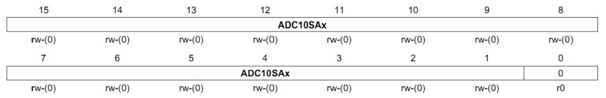

# Conversor A/D

## Características do Conversor A/D - ADC10

- 10 bits de resolução usando a técnica SAR
- Taxa máxima de conversão de até 200ksps
- Amostragem e Retenção (Sample-and-hold) com período programável
- Tensãos de referência interna **(1.5V ou 2.5V)** selecionável por software
- Referências de tensão externas
- Até 8 entradas analógicas externas
- Controle de Transferência de Dados
- 4 Modos de operação
    - Canal único
    - Canal único repetido
    - Sequência de canais
    - Sequência de canais repetida

### Registradores
#### ADC10CTL0
Registrador de controle 0

  

> Os bits em cinza só podem ser modificados quando ENC = 0, ou seja, quando a conversão for concluída

|               	|                                               Descrição                                              	|                                          Descrição do BIT                                         	|                             Descrição do BIT                             	|
|:-------------:	|:----------------------------------------------------------------------------------------------------:	|:-------------------------------------------------------------------------------------------------:	|:------------------------------------------------------------------------:	|
| **ADC10SHTx** 	|                                   Tempo de sample-and-hold do ADC10                                  	|                             00 - 4 x ADC10CLKs  01 - 8 x ADC10CLKs                             	|                10 - 16 x ADC10CLKs  11 - 64 x ADC10CLKs               	|
|  **ADC10SR**  	|                                      Taxa de amostragem do ADC10                                     	|                           0 - Buffer de referência suporta até ~200ksps                           	|               1 - Buffer de referência suporta até ~50ksps               	|
|   **REFOUT**  	|                                          Saída de referência                                         	|                                 0 - Saída de referência desligado                                 	|                      1 - Saída de referência ligado                      	|
|  **REFBURST** 	|                                          Burst de referência                                         	|                           0 - Buffer de referência ligado continuamente                           	|     1 - Buffer de referência ligado apenas na amostragem-e-conversão     	|
|    **MSC**    	|                                   Amostragem e conversão múltiplas                                   	| 0 - A amostragem requer uma borda de subida do singal SHI para ativar cada amostragem-e-conversão 	| 1 - A primeira borda de subida do sinal SHI ativa o timer de amostragem. 	|
|  **REF2_5V**  	|                            Tensão de referência (REFON deve estar ativado)                           	|                                              0 - 1.5V                                             	|                                 1 - 2.5V                                 	|
|   **REFON**   	|                                Ligar / Desligar gerador de referência                                	|                                              0 - OFF                                              	|                                  1 - ON                                  	|
|  **ADC10ON**  	|                                     Ligar / Desligar conersor AD                                     	|                                           0 - ADC10 OFF                                           	|                               1 - ADC10 ON                               	|
|  **ADC10IE**  	|                              Habilitar interrupção ao final da conversão                             	|                                    0 - Interrupção Desabilitada                                   	|                        1 - Interrupção Habilitada                        	|
|  **ADC10IFG** 	|                                     Flag de interrupção do ADC10                                     	|                                    0 - Sem interrupção pendente                                   	|                       1 - Com interrupção pendente                       	|
|    **ENC**    	|                                   Habilitar / Desabilitar conversão                                  	|                                       0 - ADC10 Desabilitado                                      	|                           1 - ADC10 Habilitado                           	|
|  **ADC10SC**  	| Iniciar conversão (gatilho por software, ADC10SC e ENC devem estar setados juntos com uma instrução) 	|                              0 - amostragem-e-conversão não iniciada                              	|                    1 - Iniciar amostragem-e-conversão                    	|

Para selecionarmos a tensão de referência, usamos os bits **SREF0, SREF1 e SREF2.**

  

#### ADC10CTL1
Registrador de controle 1

|                	|                           Descrição                           	|                                 Descrição do BIT                                	|                                        Descrição do BIT                                       	|
|:--------------:	|:-------------------------------------------------------------:	|:-------------------------------------------------------------------------------:	|:---------------------------------------------------------------------------------------------:	|
|    **INCHx**   	|                  Seletor de canal de entrada                  	| 0000 - A0  0001 - A1  0010 - A2  0011 - A3  0100 - A4  0101 - A5 	| 0110 - A6  0111 - A7  1000 - VeREF  1001 - VREF/VeREF  1010 Sensor de temperatura 	|
|    **SHSx**    	|        Seletor do clock do circuito de sample-and-hold        	|                      00 - Bit ADC10SC  01 - Timer_A.OUT1                     	|                            10 - Timer_A.OUT0  11 - Timer_A.OUT2                            	|
|   **ADC10DF**  	|                    Formato de data do ADC10                   	|                                   0 - Binário                                   	|                                      1 - Complemento de 2                                     	|
|    **ISSH**    	|              Inverter o sinal de sample-and-hold              	|                                 0 - Não inverter                                	|                                          1 - Inverter                                         	|
|  **ADC10DIVx** 	|               Fator de divisão do clock do ADC10              	|                 000 - /1  001 - /2  010 - /3  011 - /4                 	|                        100 - /5  101 - /6  110 - /7  111 - /8                        	|
| **ADC10SSELx** 	|               Seletor de fonte de clock do ADC10              	|                           00 - ADC10OSC  01 - ACLK                           	|                                   10 - MCLK  11 - <SMCLK>                                  	|
|   **CONSEQx**  	|                 Seleção de canal de conversão                 	|                  00 - Canal único  10 - Sequência de canais                  	|                01 - Canal único repetido  11 - Sequência de canais repetida                	|
|  **ADC10BUSY** 	| Indica uma amostragem que está ativa ou operação de conversão 	|                         0 - Nenhuma operação está ativa                         	|                     1 - Uma sequência, amostragem ou conversão está ativa                     	|

#### ADCAE0
Habilita a porta analógica dos pinos

|              	|                              Descrição                             	|           Descrição do BIT          	|          Descrição do BIT         	|
|:------------:	|:------------------------------------------------------------------:	|:-----------------------------------:	|:---------------------------------:	|
| **ADC10AEx** 	| Habilita a função analógica dos pinos (BIT0 - A0, BIT1 - A1, etc.) 	| x0 - Entrada analógica desabilitada 	| x1 - Entrada analógica habilitada 	|

#### ADC10DTC0
Controlador de transferência de dados 0

|             	|                                                                                         Descrição                                                                                        	|                                Descrição do BIT                               	|                                                      Descrição do BIT                                                     	|
|:-----------:	|:----------------------------------------------------------------------------------------------------------------------------------------------------------------------------------------:	|:-----------------------------------------------------------------------------:	|:-------------------------------------------------------------------------------------------------------------------------:	|
| **ADC10TB** 	|                                                                                Modo de dois bloco do ADC10                                                                               	|                     0 - Modo de transferência de um bloco                     	|                                          1 - Modo de transferência de dois blocos                                         	|
| **ADC10CT** 	|                                                                              Transferência contínua do ADC10                                                                             	| 0 - A Transferência de dados para quando um, ou dois, blocos tenho completado 	| 1 - Dados são transferidos continuamente. A operação de DTC é parada apenas se ADC10CT for limpo ou ADC10SA for reescrito 	|
| **ADC10B1** 	| Para o modo de dois blocos, ele indica qual deles será preenchido com o resultado da conversão do ADC10. Ele é apenas válido após ADC10IFG for setado primeiro durante a operação de DTC 	|                             0 - Preencher bloco 1                             	|                                                   1 - Preencher bloco 2                                                   	|

#### ADC10DTC1
Controlador de transferência de dados 1

|            	|                      Descrição                     	|
|:----------:	|:--------------------------------------------------:	|
| **BIT7-0** 	| Definem o número de transferências para cada bloco 	|

#### ADC10SA
Endereço inicial para o DTC

|              	|               Descrição               	|
|:------------:	|:-------------------------------------:	|
| **ADC10SAx** 	| Os bits são o endereço inicial do DTC 	|

> Exemplo: ADC10SA = &ADC10_vetor[0];

## Exemplo 1

Um **sensor resistivo de nível** fornece um sinal analógico, variando de 0V até a tensão de referência que é fornecida a ele, sendo proporcional ao nível de um **reservatório de gasolina de um automóvel**.
Efetue a leitura deste sensor a cada **100ms (ta)** e indique o nível do reservatório através de **5 Leds** conectados na **Porta 2** (Como mostrado na figura). Usaro o **Timer0** para **Gerar sinal de gatilho (por hardware)** e simule o sensor usando um **potenciômetro de 10k**

  

Como o conversor possui 10 bits de resolução, ou seja, conseguimos uma palavra digital de $2^{10} - 1 = 1023$. Podemos então dividir o nível do tanque com base nas palavras retiradas do conversor A/D.

  

### Configurações do ADC10:
- **Consumo de energia:** Normal
- **Taxa de conversão:** máxima (~200ksps)
- **Clock:** ADC10OSC
- **Buffer de referência:** não utilizado
- **Gatilho:** por hardware via módulo 1 do Timer0
