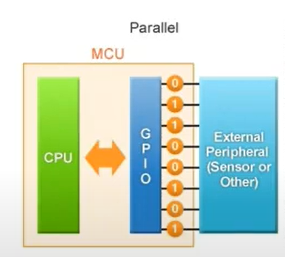
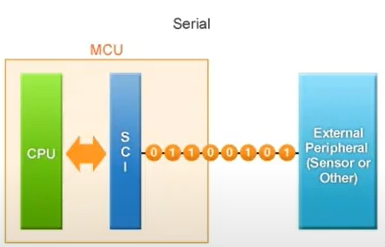
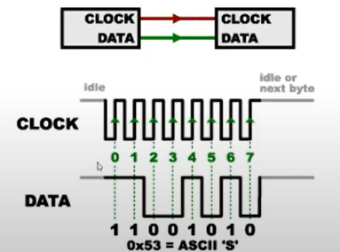

# Interface USCI
*Universal Serial Communication Interface*

## Tipos de interface de comunicação

### Paralela
Vários fios que representam uma palavra digital entre microcontrolador e dispositivo. Porém, como consome muitos pinos do microcontrolador, acaba limitando outras possíveis funções dele.

### Serial
Os bits são enviados de forma sequêncial um atrás do outro

#### Interface Serial Síncrona
Usada para conexão entre dispositivos em uma mesma placa PCB.

**Ex de transmissão de um byte**

> Uma interface serial síncrona pode ter dois modos **SPI** e **I^2C**

> Entende-se por escravo todo periférico que é comandado pelo microcontrolador (Acelerômetro, Sensor Comercial, Memória Flash, Cartão de Memória, CI, etc.). Porém é no programa que é definido quem será o mestre e quem será o escravo