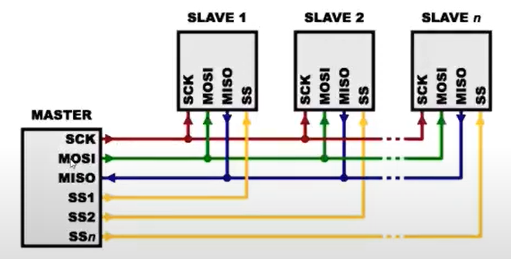
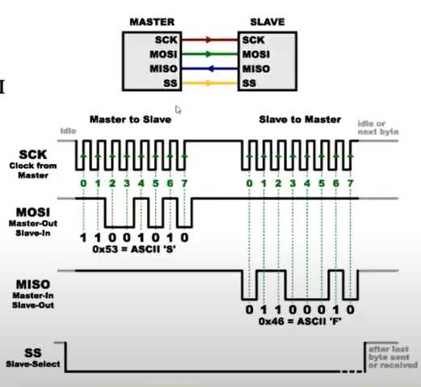
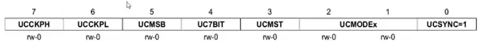
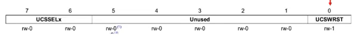
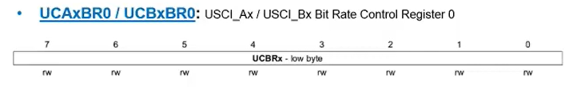
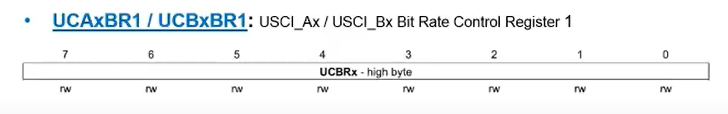
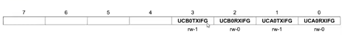
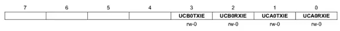
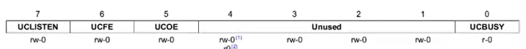

# Interface SPI
*Serial Peripheral Interface*

Onde:
- MOSI: Master Ouput Slave Input
- MISO: Master Input Slave Output
- SS: Slave Select (O Programa deve controlar esse sinal)
- SCK: Clock

**Exemplo:**

> O Sinal SS deve estar em nível baixo para que haja comunicação. Ao Final esse sinal é colocado em nível alto

## Passos para Inicialização do USCI no Modo SPI
- Setar bit UCSWRST
- Inicializar todos os registradores com UCSWRST = 1
- Configurar portas
- Resetar bit UCSWRST
- Habilitar Interrupção (opcional)

## Registradores

### UCAxCTL0 / UCBxCTL0
Registrador de Controle 0 do USCI_Ax / USCI_Bx

|             	|                                                       Descrição                                                      	|                                              Descrição do BIT                                             	|                                         Descrição do BIT                                         	|
|:-----------:	|:--------------------------------------------------------------------------------------------------------------------:	|:---------------------------------------------------------------------------------------------------------:	|:------------------------------------------------------------------------------------------------:	|
|  **UCCKPH** 	|                                               Seleção de fase do clock                                               	|      0 - Os dados são alterados na primeira borda do clock (UCLK) e são capturados na seguinte borda      	|   1 - Dados são capturados na primeira borda de clock (UCLK) e são alterados na seguinte borda   	|
|  **UCCKPL** 	|                                            Seleção de polaridade do clock                                            	|                                       0 - O estado *inativo* é baixo                                      	|                                   1 - O estado *inativo* é alto                                  	|
|  **UCMSB**  	| Seleção do bit mais significativo (MSB). Controla a direção de recepção e transmissão do registrador de deslocamento 	|                                 0 - LSB (Bit Menos Significativo) primeiro                                	|                             1 - MSB (Bit Mais Significativo) primeiro                            	|
|  **UC7BIT** 	|                                         Tamanho do caracter a ser transmitido                                        	|                                            0 - Dados de 8 bits                                            	|                                        1 - Dados de 7 bits                                       	|
|  **UCMST**  	|                                                Seleção do modo MASTER                                                	|                                               0 - Modo SLAVE                                              	|                                          1 - Modo MASTER                                         	|
| **UCMODEx** 	|                          Modo do USCI (para seleção dos modos síncronos o UCSYNC deve ser 1)                         	| 00 - SPI de 3 pinos  01 - SPI de 4 pinos com UCxSTE ativo em alto (Slave habilitado quando UCxSTE = 1) 	| 10 - SPI de 4 pinos com UCxSTE ativo em baixo (Slave habilitado quando UCxSTE = 0) 11 - Modo I²C 	|
|  **UCSYNC** 	|                                           Habilitar modos síncronos do USCI                                          	|                                               0 - Assíncrono                                              	|                                           1 - Síncrono                                           	|

> Para transmitir uma palavra de 16 bits é preciso transmitir primeiro o bit mais significativo e logo após o menos significativo, assim é possível compor uma palavre de 16 bits

### UCAxCTL1 / UCBxCTL1
Registrador de Controle 1 do USCI_Ax / USCI_Bx

|             	|                Descrição               	|    Descrição do BIT   	|      Descrição do BIT     	|
|:-----------:	|:--------------------------------------:	|:---------------------:	|:-------------------------:	|
| **UCSSELx** 	| Seleção do clock para a interface USCI 	| 00 - NA  01 - ACLK 	| 10 - SMCLK  11 - SMCLK 	|
| **UCSWRST** 	|      Habilitar reset por software      	|    0 - Desabilitado   	|       1 - Habilitado      	|

### UCAxBR0 / UCB_BR0
Rigistrador de Controle 0 de BitRate

|           	|         Descrição        	|
|:---------:	|:------------------------:	|
| **UCBRx** 	| Byte menos significativo 	|

### UCAxBR1 / UCB_BR1
Rigistrador de Controle 1 de BitRate

|           	|        Descrição        	|
|:---------:	|:-----------------------:	|
| **UCBRx** 	| Byte mais significativo 	|

$$ f_{BitClock} = \frac{f_{BRCLK}}{UCBRx}$$

### IFG2
Registrador de flag de interrução 2

|               	|                                              Descrição                                             	| Descrição do bit             	| Descrição do bit             	|
|:-------------:	|:--------------------------------------------------------------------------------------------------:	|------------------------------	|------------------------------	|
| **UCB0TXIFG** 	|         Flag de interrução da transmissão do USCI_B0. É setado quando UCB0TXBUF está vazio         	| 0 - Sem interrução pendente  	| 1 - Com interrução pendente  	|
| **UCB0RXIFG** 	| Flag de interrupção da recepção do USCI_B0. É setado quando UCB0RXBUF receber um caracter completo 	| 0 - Sem interrupção pendente 	| 1 - Com interrupção pendente 	|
| **UCA0TXIFG** 	|         Flag de interrução da transmissão do USCI_A0. É setado quando UCA0TXBUF está vazio         	| 0 - Sem interrução pendente  	| 1 - Com interrução pendente  	|
| **UCA0RXIFG** 	| Flag de interrupção da recepção do USCI_A0. É setado quando UCA0RXBUF receber um caracter completo 	| 0 - Sem interrupção pendente 	| 1 - Com interrupção pendente 	|

#### IE2
Registrador de habilitação de interrupção 2

|               	|                                              Descrição                                             	| Descrição do bit             	| Descrição do bit             	|
|:-------------:	|:--------------------------------------------------------------------------------------------------:	|------------------------------	|------------------------------	|
| **UCB0TXIE** 	|         Habilitar interrução da transmissão do USCI_B0.         	| 0 - interrução desabilitada  	| 1 - Interrupção habilitada  	|
| **UCB0RXIE** 	|         Habilitar interrução da recebimento do USCI_B0.         	| 0 - interrução desabilitada  	| 1 - Interrupção habilitada  	|
| **UCA0TXIE** 	|         Habilitar interrução da transmissão do USCI_A0.         	| 0 - interrução desabilitada  	| 1 - Interrupção habilitada  	|
| **UCA0RXIE** 	|         Habilitar interrução da recebimento do USCI_A0.         	| 0 - interrução desabilitada  	| 1 - Interrupção habilitada  	|

#### UCAxSTAT / UCBxSTAT
Registrador de status do USCI_Ax / USCI_Bx

|               	|                                              Descrição                                             	| Descrição do bit             	| Descrição do bit             	|
|:-------------:	|:--------------------------------------------------------------------------------------------------:	|------------------------------	|------------------------------	|
| **UCLISTEN** 	|         Habilitar Listen         	| 0 - Desabilitado  	| 1 - Habilitado  	|
| **UCFE** 	|         Flag de erro de framing. Indica conflito nos barramentos no modos MASTER de 4 pinos        	| 0 - Sem erro  	| 1 - Conflito no barramento ocorrido  	|
| **UCOE** 	|         Flag de erro de overrun. Esse bit é setado quando o caracter é transferido para UCxRXBUF antes de caracter anterior ser lido. Ele é limpo automaticamente quando UCxRXBUF for lido e **não deve ser limpo por software**, caso contrário não funcionará corretamente         	| 0 - Sem erro  	| 1 - Overrun ocorrido |
| **UCBUSY** 	|         Indica se uma operação de transmissão ou recebimento está ocorrendo.         	| 0 - USCI inativo  	| 1 - USCI transmitindo ou recebendo  	|
