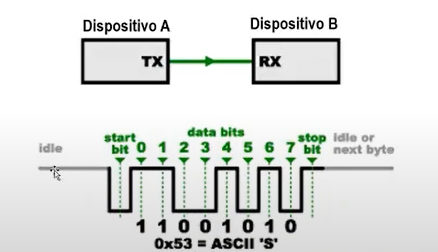
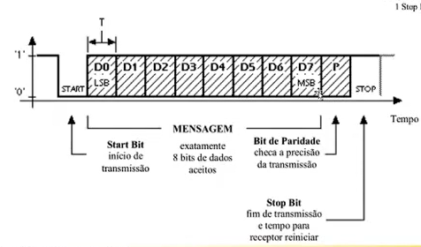

# Interface UART
*Universal Asynchronous Receiver / Transmitter*

Em interfaces assíncronas, entre dois dispositivos (A e B), apenas um deles irá transmitir os dados, enquanto o outro irá receber, enquanto isso ocorre, o sinal entre o transmissor (TX) e o receptor (RX) é dado por essa forma:

> Um pulso em nível baixo caracteriza o bit de início (start bit) o contrário ocorre com o bit final

Na interface UART os dados são transmitidos através de um FRAME

