# TIMER A

## Sistema básico de Clock (BCS)

### Clocks básicos

#### ACLK (Auxiliary Clock)
- Clock auxiliar
- Baixa frequência

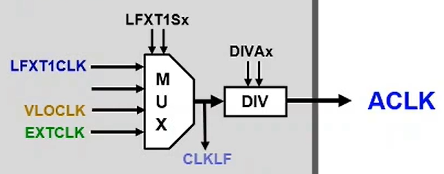<br><br>

#### MCLK (Main Clock)
- Clock principal
- Interage diretamente com a CPU

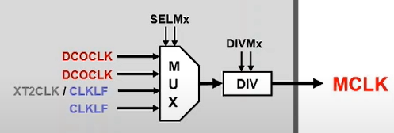<br><br>

#### SMCLK (Sub Main Clock)
- Clock secundário
- Alimenta os periféricos

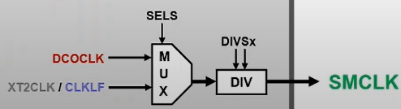<br><br>
<br>

### Osciladores

#### VLOCLK
- Baixo consumo de energia
- Baixa frequência (10KHz ~ 20KHz)
- Baseado em carga e descarga de capacitor
<br><br>

#### LFXT1CLK
- Usa um cristal de quartzo como referência **(32.768Hz)**
- É possível entrar com sinal de clock externo
<br><br>

#### XT2CLK
- Alta frequência
<br><br>

#### DCOCLK (Digital Configurable Oscilator Clock)
- Oscilador digital configurável
- Clock ajustável
- Geralmente utilizado pela CPU
- Configuração inicial:
    - RSELx = 7
    - DCOx = 3
    - MODx = 0
    - Resultando em uma frequência 0.8MHz ~ 1.5MHz 

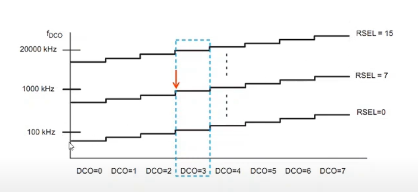

O DCO possui frequências pré-calibradas pelo fabricante. Os valores para essas frequências estão armazenadas em **memória flash de 256 Bytes** que contém as sequintes frequências: *1MHz, 8MHz, 12MHz e 16MHz*. Essas frequências podem ser configuradas pelos registradores **DCOCTL** e **BCSCTL1**. Ex:

```C
// [FREQ] = 1MHZ ou 8MHZ ou 12MHZ ou 16MHZ
// [FREQ] deve ser igual para os dois registradores
DCOCTL = CALDCO_[FREQ];
BCSCTL1 = CALBC1_[FREQ];
```
<br>

### Registradores

#### BCSCTL1 (Basic Clock System Control 1)

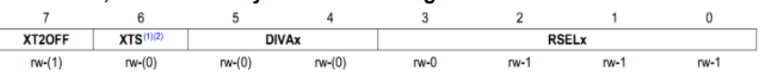
> rw-1 = é possível ler e escrever o bit e seu valor inicial é igual a 1

|        	|                                            Descrição                                            	|                    Descrição dos BIT                    	|                    Descrição dos BIT                    	|
|:------:	|:-----------------------------------------------------------------------------------------------:	|:-----------------------------------------:	|:-----------------------------------------:	|
| XT2OFF 	|                                      Ligar ou desligar XT2                                      	|             1 - XT2 Desligado             	|               0 - XT2 Ligado              	|
|   XTS  	|                                   Modo de frequência do LFXT1                                   	|        1 - Modo de alta frequência        	|        0 - Modo de baixa frequência       	|
|  DIVAx 	|                              Fator de divisão para o clock auxiliar                             	| 00 - Divisão por 1<br> 01 - Divisão por 2 	| 10 - Divisão por 4<br> 11 - Divisão por 8 	|
|  RSELx 	| Selecionar a frequência do clock (pré-definido pelo fabricante nos registradores CALBC1_[FREQ]) 	|                                           	|                                           	|
<br><br>

#### BCSCTL2 (Basic Clock System Control 2)
Usado para configurar o clock principal e secundário

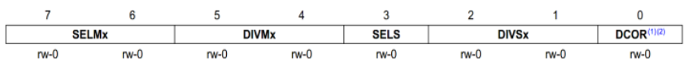

|           	|                   Descrição                   	|                    Descrição dos BIT                    	|                                                  Descrição dos BIT                                                  	|
|:---------:	|:---------------------------------------------:	|:-----------------------------------------:	|:-----------------------------------------------------------------------------------------------------:	|
| **SELMx** 	|  Seleciona a fonte do clock principal (MCLK)  	|          00 - DCOCLK<br> 01 - DCOCLK          	| 10 - XT2CLK (Apenas quando o oscilador XT2 está presente no microcontrolador)<br> 11 - LFXT1CLK ou VLOCLK 	|
| **DIVMx** 	|     Fator de divisão para clock principal     	| 00 - Divisão por 1<br> 01 - Divisão por 2 	|                               10 - Divisão por 4<br> 11 - Divisão por 8                               	|
|  **SELS** 	| Seleciona a fonte do clock secundário (SMCLK) 	|                 0 - DCOCLK                	|                1 - LFXT1CLK ou VLOCLK (apenas quando o oscilador XT2 não está presente)               	|
| **DIVSx** 	|    Fator de divisão para o clock secundário   	| 00 - Divisão por 1<br> 01 - Divisão por 2 	|                               10 - Divisão por 4<br> 11 - Divisão por 8                               	|
| **DCOR**  	| Seletor do resistor do DCO                    	| 0 - Resistor interno                      	| 0 - Resistor externo                                                                                  	|
<br>

#### BCSCTL3 (Basic Clock System Control 3)
Usado para configurar as faixas de frequência e as capacitâncias conectadas ao cristal

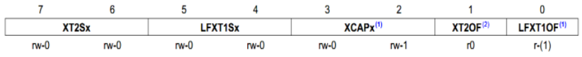

|             	|                                     Descrição                                    	|                                      Descrição do BIT                                     	|                                              Descrição do BIT                                              	|
|:-----------:	|:--------------------------------------------------------------------------------:	|:-----------------------------------------------------------------------------------------:	|:----------------------------------------------------------------------------------------------------------:	|
|  **XT2Sx**  	|                        Seletor da faixa de frequência XT2                        	| 00 - 0.4MHz - 1MHz do cristal ou ressonador<br> 01 - 1MHz - 3MHz do cristal ou ressonador 	| 10 - 3MHz - 16MHz do cristal ou ressonador<br> 11 - Fonte digital externa do clock primário 0.4MHz - 16MHz 	|
| **LFXT1Sx** 	| Seletor de clock de baixa frequência e selecionar a faixa de frequência do LFXT1 	|                              00 - 32.768Hz<br> 01 - Reservado                             	|                               10 - VLOCLK 11 - Fonte digital de clock externa                              	|
|  **XCAPx**  	|                         Seleção do capacitor do oscilador                        	|                                  00 - ~1pF<br> 01 - ~6pF                                  	|                                         10 - ~10pF<br> 11 - ~12.5pF                                        	|
| **XT2OF**   	| Verifica condição de falha no oscilador XT2                                      	| 0 - Sem condição de falha                                                                 	| 1 - Condição de falha presente                                                                             	|
| **LFXT1OF** 	| Verifica condição de falha no oscilador LFXT1                                    	| 0 - Sem condição de falha                                                                 	| 1 - Condição de falha presente                                                                             	|
> O oscilador LFXT1 não começa com frequência de 32.768Hz no tempo 0. O oscilador aplica pulsos no cristal até que chegue a frequência do cristal
<br><br>

### Exemplo de Configuração

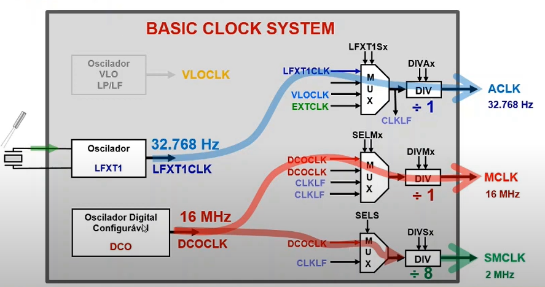

```C
void start_micro(){
    WDTCTL = WDTPW | WDTHOLD;

    DCOCTL = CALDCO_16MHZ;

    /*
        XT2OFF          1000 0000
        + CALBC1_16MHZ    0000 xxxx
                        1000 xxxx
    */
    BCSCTL1 = XT2OFF + CALBC1_16MHZ;

    // DIVSx = 11 - Divisão por 8
    BCSCTL2 = DIVS0 + DIVS1;

    // XCAPx = 11 ~12.5pF
    BCSCTL3 = XCAP0 + XCAP1;

    // Verificar se o oscilador LFXT1 está na frequência do cristal
    // Executar o loop vazio enquanto LFXT1OF não esteja estável
    // Quando LFXT1OF for estável, ele é limpo pela CPU
    while(BCSCTL3 & LFXT1OF);

    __enable_interrupt();
}
```

## Temporizador
A cada borda de subida do nosso clock com período $t_{clock}$, um contador é incrementado, a partir disso podemos provocar uma **interrupção** a cada $N$ ciclos do nosso clock. Em resumo, podemos obter o valor de temporização através de:

$$T_{int} = \sum_{n=0}^{n=N} t_{clock}$$

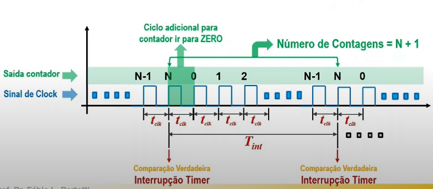

### Timer A
- Temporizador de 16bits
- 4 Modos de operação
    - Contador (usado apenas para contar)
    - Captura (medir o intervalo de tempo entre dois eventos)
    - Comparação
    - PWM
- Ele possui 3 registradores de captura/comparação

### Modo Contador
O modo contador do timer A pode assumir 3 modos de contage:
- **UP:** Incremento;
- **UP / DOWN:** Incremento e Decremento;
- **Contínuo**

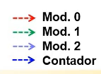

> O módulo 0 (tanto no modo UP quanto UP/DOWN) poode resetar o contador ou inverter o sentido de contagem

> O módulo 0 ativa uma flag de interrupção TAxCCIFG0 (possui uma RTI de interrupção própria, enquanto o módulo 1 e 2 compartilham uma RTI)

#### Modo de contagem UP
O contador vai incrementar até o valor de comparação do registrador do **módulo 0** (*TACCR0*)

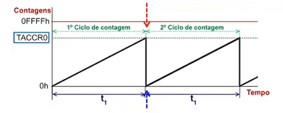
> A medida que o valor do registrador TACCR0 aumenta, $t_1$ também irá aumentar


#### Modo de contagem UP / DOWN
O contador vai incrementar até o valor de comparação do registrador do **módulo 0**, após isso ele começa a decrementar até atingir o valor de 0

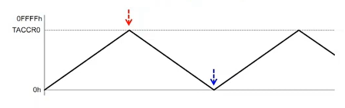


#### Modo de contagem contínuo
O contador vai incrementar até o valor máximo do registrador do **módulo 0** (*2^16 = 65.536*)

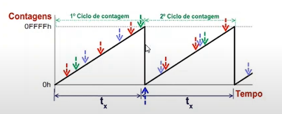

### Modo Comparação
O contador começa a contar a partir de 0, quando chegar a $N$ ciclos de clock, um comparador da um reset no contador e ativa uma flag de interrupção na CPU
> Lembrando que são N+1 contagens, pois é necessário mais um ciclo de clock para o contador retornar a 0


#### Cálculo do tempo para interrupção

$$Valor_{registrador} = N = tempo \times frequencia_{clock} - 1$$

Em resumo...

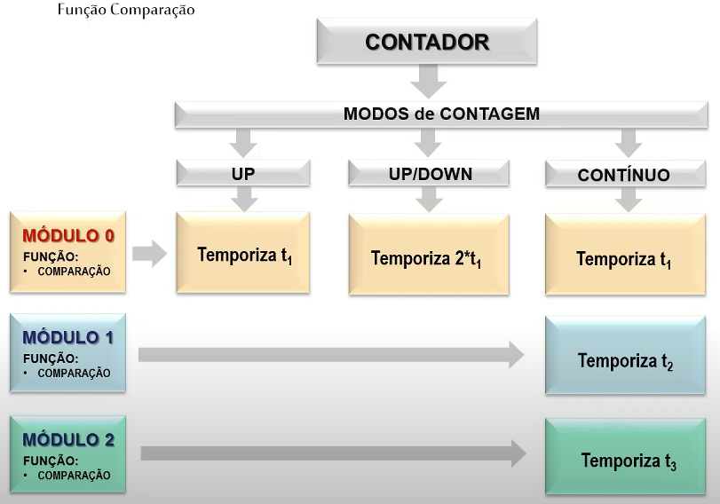

## Efeito Bounce

Ocorre quando, no precionamento de chaves mecânicas, há um mal contato que acarreta em um trepidação do sinal.

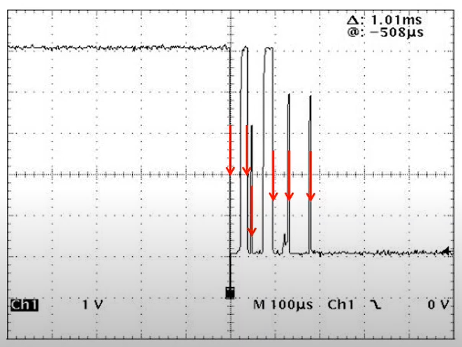

### Debounce

Técnica para evitar o efeito de bounce

## PWM

Sinal cuja a razão cíclica é variada, utilizado em:
- Controle de velocidade de motores DC;
- Conversores DC - DC
- Geração de sinais (ondas quadradas, senoides, etc.)

### Gerando sinal PWM

É possível gerar até 2 sinais PWM por timer

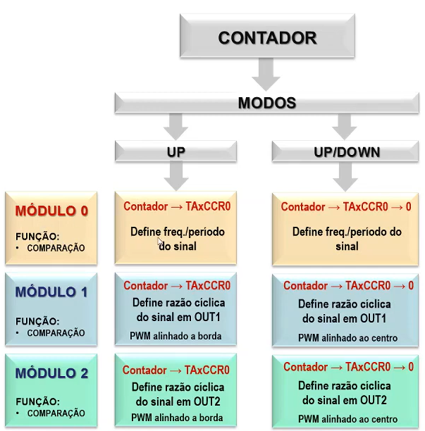

> Módulo 1 e 2: Gerar o sinal PWM

> Módulo 0: Define a frequência do sinal PWM

### Modos de saída do sinal PWM

#### Modo de saída 1 (Set)

A saída do sinal é setada quando TAR = TACCR1

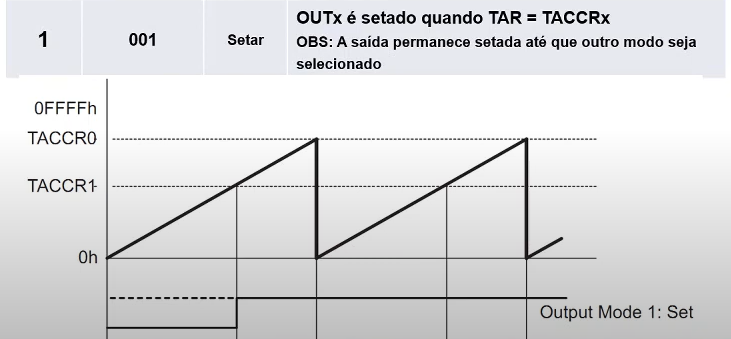

#### Modo de saída 2 (Toggle/Reset)

A saída do sinal é invertida toda vez que TAR = TACCR1 e resetado quando TAR = TACCR0

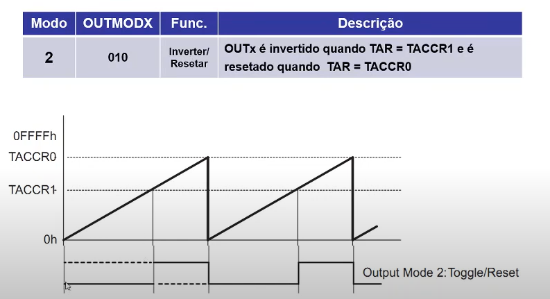

#### Modo de saída 3 (Set/Reset)

Semelhante ao modo de saída 2, a saída do sinal é setada toda vez que TAR = TACCR1 e resetado quando TAR = TACCR0

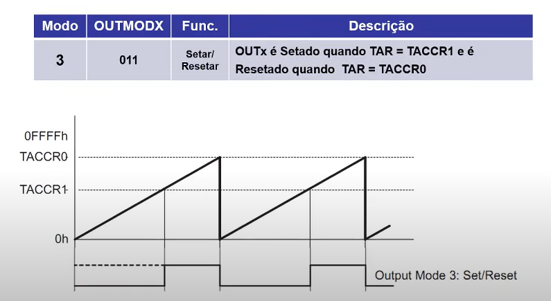

#### Modo de saída 4 (Toggle)

A saída do sinal é invertida toda vez que TAR = TACCR1

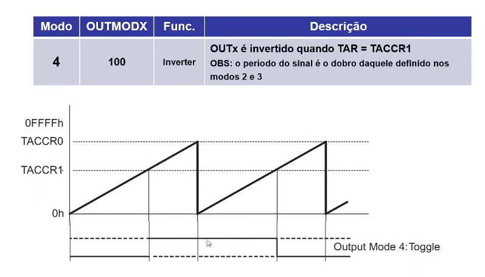

#### Modo de saída 5 (Reset)

A saída do sinal é resetada quando TAR = TACCR1

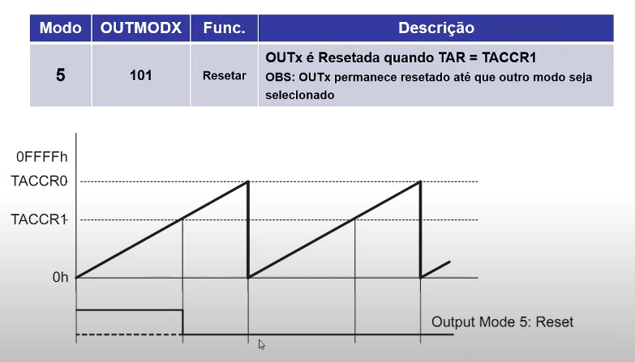

#### Modo de saída 6 (Toggle/Set)

A saída do sinal é invertida toda vez que TAR = TACCR1 e setada quando TAR = TACCR0

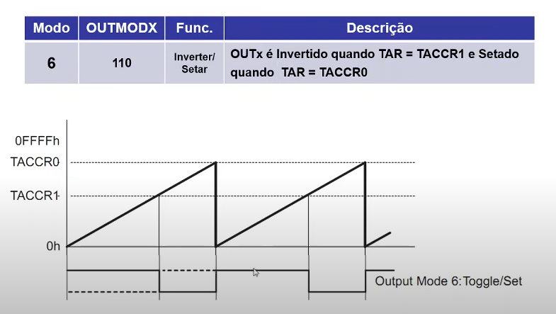

#### Modo de saída 7 (Reset/Set)

A saída do sinal é resetada toda vez que TAR = TACCR1 e setada quando TAR = TACCR0

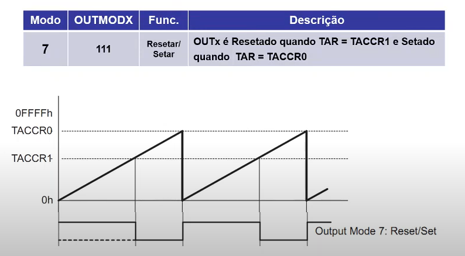

> NÃO É PRECISO HABILITAR INTERRUPÇÃO PARA GERAR SINAL PWM
